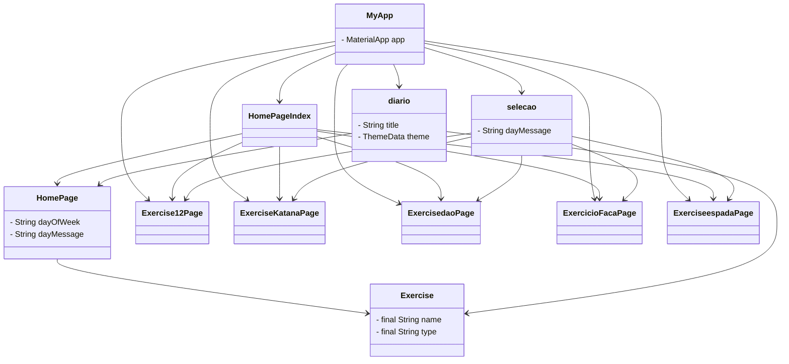

# treino_stephan

Projeto em Flutter usando linguagem DART para organizar treinamento diário com armas brancas e de fogo para finalidade esportiva e marcial.

## diagrama de classes

```mermaid

classDiagram
  class MyApp {
    - MaterialApp app
  }

  class diario {
    - String title
    - ThemeData theme
  }

  class HomePage {
    - String dayOfWeek
    - String dayMessage
  }

  class selecao {
    - String dayMessage
  }

  class Exercise {
    - final String name
    - final String type
  }

  class Exercise12Page
  class ExerciseKatanaPage
  class ExercisedaoPage
  class ExercicioFacaPage
  class ExerciseespadaPage
  class HomePageIndex

  MyApp --> HomePageIndex
  MyApp --> selecao
  MyApp --> diario
  MyApp --> Exercise12Page
  MyApp --> ExerciseKatanaPage
  MyApp --> ExercisedaoPage
  MyApp --> ExercicioFacaPage
  MyApp --> ExerciseespadaPage

  HomePageIndex --> HomePage
  HomePageIndex --> Exercise12Page
  HomePageIndex --> ExerciseKatanaPage
  HomePageIndex --> ExercisedaoPage
  HomePageIndex --> ExercicioFacaPage
  HomePageIndex --> ExerciseespadaPage

  selecao --> ExerciseespadaPage
  selecao --> Exercise12Page
  selecao --> ExercisedaoPage
  selecao --> ExercicioFacaPage
  selecao --> ExerciseKatanaPage

  HomePage --> Exercise
  diario --> HomePage
  diario --> Exercise

```
